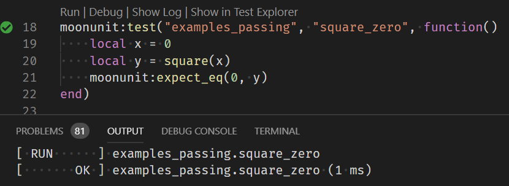

# MoonUnit

This is a command-line tool that pretends to be a test runner using
Google Test, but is in fact secretly a Lua interpreter equipped with
code to find, organize, and run Lua-based unit tests.

## Usage

    Usage: MoonUnit [--path=PATH]
                    [--gtest_list_tests]
                    [--gtest_filter=FILTER]
                    [--gtest_output=xml:REPORT]

       or: MoonUnit --help

    PATH    The relative or absolute path to a folder which contains
            (or has a direct ancestor folder which contains) a '.moonunit' file
            specifying paths to directories containing Lua test files to run
            (or other '.moonunit' files) or individual Lua test files to run.
            If not specified, the current working directory is used instead.

    FILTER  One or more test names separated by colons, which selects
            just the named tests to be run.
            If not specified, all discovered tests will be run.

    REPORT  The relative or absolute path to an XML file to be generated
            containing a report about the tests discovered by the test runner,
            in a format compatible with Google Test.
            Unless this is specified, no report will be generated.

When the `--help` option is given, the program prints usage information, along
with this special line meant to fool the `Catch2 and Google Test Explorer`
plugin for VSCode:

    This program contains tests written using Google Test.

What this program *actually* contains is a Lua interpreter and code which
discovers and executes unit tests written in Lua.  Place a `.moonunit` file in
the root folder of your project, and in that file list paths from there to
individual Lua test files to run, or paths to directories containing other
`.moonunit` files and/or Lua test files, and `MoonUnit` will discover all your
tests and run them for you, provided you either set the working directory
somewhere inside your project, or specify the project's folder using the
`--path` command-line argument.  Neat, huh?

What's really cool is `MoonUnit` makes its output look like Google Test,
and supports the minimum command-line arguments required by
the `Catch2 and Google Test Explorer` plugin for VSCode,
so that it should seamlessly integrate into a VSCode 'solution' along with
other test runners.

## Configuration

In most cases, placing a `.moonunit` file at the top-level folder of your
project and listing in this file the relative paths (one per line) from this
file to the folders containing your Lua test scripts is sufficient to configure
`MoonUnit`.

To integrate `MoonUnit` into a VSCode solution using
`Catch2 and Google Test Explorer`, place a build of the `MoonUnit` executable
somewhere in your project, set up the `catch2TestExplorer.executables` user
or project setting as an array, and add the following to it:

```json
{
    "name": "Lua",
    "description": "Tests discovered by MoonUnit",
    "pattern": "**/{MoonUnit,MoonUnit.exe}",
    "cwd": "${workspaceDirectory}"
}
```

Using the `Test Explorer UI` VSCode extension, with `MoonUnit` properly
integrated, you should see your Lua test suites and tests listed in the panel:


You should be able to use the `run` or `show source` (or `debug`, for what it's
worth) buttons as well as simply clicking on a test to run the test, see the
test results, and jump to the source code of the test.  Similar controls should
appear in the test source code as well:



A test failure should show the failed expectation(s) and include (clickable!)
links to the lines in the test source code where the failures occurred:


Since Lua is not compiled, there is no need to "build" the project when adding,
removing, or changing Lua code or scripts.  Simply use the top-level
`run tests` button for the Lua tests and `MoonUnit` will provide an updated
collection of test suites and tests on the fly:


## Test Design

In each Lua test script, you define and register a test by calling the
`moonunit.test` method, as in this example:

```lua
moonunit:test("my_tests", "square", function()
    local x = 5
    local y = square(x)
    moonunit:expect_eq(25, y)
end)
```

Also shown in this example is a call to the `moonunit.expect_eq` method, which
specifies an expectation (in this case, that `y` is equal to `25`) and marks
the test as failed if the expectation is not met.  There are numerous similar
expection checking functions.  Those beginning with `expect_` mark the test as
failed but continue to execute the remainder of the test, whereas those
beginning with `assert_` cause an error to be thrown that immediately stops the
test.  Use the `assert_` variations when it does not make sense for a test to
continue if a given expectation is not met.  Otherwise, use the `expect_`
variations, as these can improve development efficiency in providing feedback
about multiple expectations either being met or not in a single test run.

The following table lists the supported expectation checking methods. each of
which is defined in two variations, `assert_` and `expect_` (for example, for
`eq` there is both `assert_eq` as well as `expect_eq`):

Method | Description
--- | ---
eq | Two given values should be equal
ne | Two given values should not be equal
lt | The first of two given values should be less than the second
le | The first of two given values should be less than or equal to the second
gt | The first of two given values should be greater than the second
ge | The first of two given values should be greater than or equal to the second
true | The given value should be true
false | The given value should be false

## Supported platforms / recommended toolchains

This is a portable C++11 program which depends only on the C++11 compiler, the
C and C++ standard libraries, and other C++11 libraries with similar
dependencies, so it should be supported on almost any platform.  The following
are recommended toolchains for popular platforms.

* Windows -- [Visual Studio](https://www.visualstudio.com/) (Microsoft Visual C++)
* Linux -- clang or gcc
* MacOS -- Xcode (clang)

## Building

This library is not intended to stand alone.  It is intended to be included in a larger solution which uses [CMake](https://cmake.org/) to generate the build system and build applications which will link with the library.

There are two distinct steps in the build process:

1. Generation of the build system, using CMake
2. Compiling, linking, etc., using CMake-compatible toolchain

### Prerequisites

* [CMake](https://cmake.org/) version 3.8 or newer
* C++11 toolchain compatible with CMake for your development platform (e.g. [Visual Studio](https://www.visualstudio.com/) on Windows)
* [LuaLibrary](https://github.com/rhymu8354/lua.git) - a fork of
  [Lua](http://www.lua.org/) which includes a `CMakeLists.txt` file for
  incorporation into a CMake-based build system
* [SystemAbstractions](https://github.com/rhymu8354/SystemAbstractions.git) - a
  cross-platform adapter library for system services whose APIs vary from one
  operating system to another

### Build system generation

Generate the build system using [CMake](https://cmake.org/) from the solution root.  For example:

```bash
mkdir build
cd build
cmake -G "Visual Studio 15 2017" -A "x64" ..
```

### Compiling, linking, et cetera

Either use [CMake](https://cmake.org/) or your toolchain's IDE to build.
For [CMake](https://cmake.org/):

```bash
cd build
cmake --build . --config Release
```
